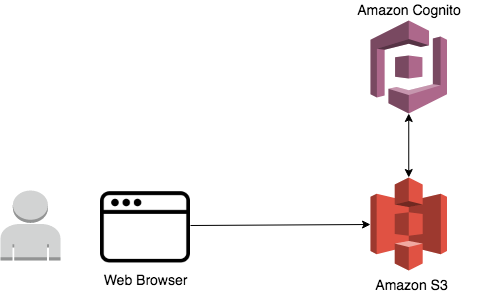
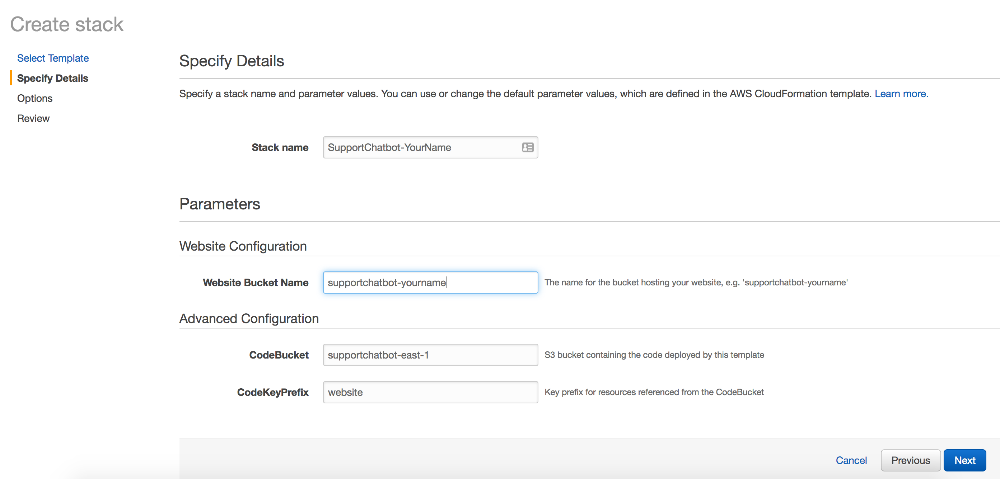
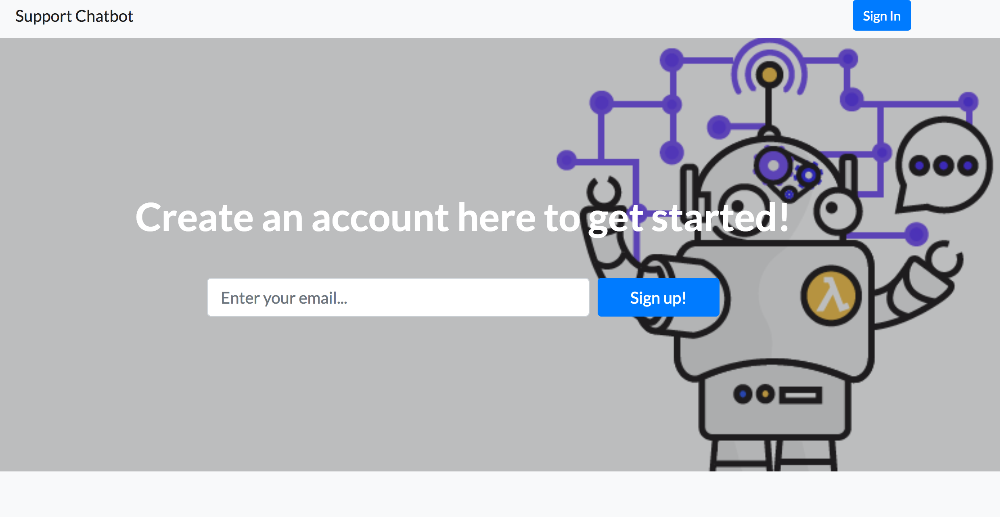

# Module 1: Static Web Hosting with Amazon S3

In this module you'll configure Amazon Simple Storage Service (S3) to host the static resources for your web application. In subsequent module you'll add user management to this website.

You can launch one of these AWS CloudFormation templates in the Region of your choice to build the necessary resources automatically.

Region| Launch
------|-----
US East (N. Virginia) | 

<strong>CloudFormation Launch Instructions (expand for details)</strong>

1. Click the **Launch Stack** link above for the region of your choice.

1. Click **Next** on the Select Template page.

1. Provide a globally unique name for the **Website Bucket Name** such as `supportchatbot-yourname` and click **Next**.
    

1. On the Options page, leave all the defaults and click **Next**.

1. On the Review page, check the box to acknowledge that CloudFormation will create IAM resources and click **Create**.
    

    This template uses a custom resource to copy the static website assets from a central S3 bucket into your own dedicated bucket. In order for the custom resource to write to the new bucket in your account, it must create an IAM role it can assume with those permissions.

1. Wait for the `supportchatbot-webapp` stack to reach a status of `CREATE_COMPLETE`.

1. With the `supportchatbot-webapp` stack selected, click on the **Resources** tab and click on the WebsiteURL link.

1. Verify the Support Chatbot home page is loading properly and move on to the next module, [User Management](../2_UserManagement).

## Architecture Overview

The architecture for this module is very straightforward. All of your static web content including HTML, CSS, JavaScript, images and other files will be stored in Amazon S3. Your end users will then access your site using the public website URL exposed by Amazon S3. You don't need to run any web servers or use other services in order to make your site available.

For the purposes of this module you'll use the Amazon S3 website endpoint URL that we supply. It takes the form `http://{your-bucket-name}.s3-website-{region}.amazonaws.com` or `bucket-name.s3-website.region.amazonaws.com` depending on the region you use. For most real applications you'll want to use a custom domain to host your site. If you're interested in using a your own domain, follow the instructions for [setting up a static website using a custom domain](http://docs.aws.amazon.com/AmazonS3/latest/dev/website-hosting-custom-domain-walkthrough.html) in the Amazon S3 documentation.

Once you've built the static site, continue to the next module, [User Management](../2_UserManagement).
