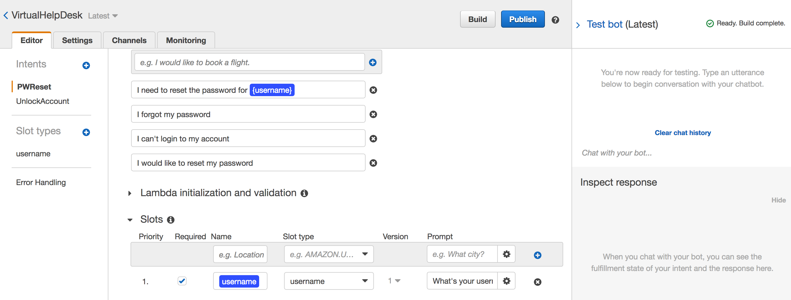

# Module 3: Create Chat bot

In this module you'll create an Amazon Lex chat bot.

___
## Step 1: Create the AWS Lambda function
You can launch one of these AWS CloudFormation templates in the Region of your choice in order to create the necessary lambda functions automatically.

Region| Launch
------|-----
US East (N. Virginia) | [](https://console.aws.amazon.com/cloudformation/home?region=us-east-1#/stacks/new?stackName=supportchatbot-lambda-1&templateURL=https://s3.amazonaws.com/supportchatbot-east-1/2_CreateChatbot/create-lambda-bot.yml)
US West (Oregon) | [](https://console.aws.amazon.com/cloudformation/home?region=us-west-2#/stacks/new?stackName=supportchatbot-lambda-1&templateURL=https://s3.amazonaws.com/supportchatbot-east-1/2_CreateChatbot/create-lambda-bot.yml)


<details>
<summary><strong>CloudFormation Launch Instructions (expand for details)</strong></summary><p>

1. Choose the **Launch Stack** link above for the region of your choice.

1. Choose **Next** on the Select Template page.

1. On the Options page, leave all the defaults and choose **Next**.

1. On the Review page, check the box to acknowledge that CloudFormation will create IAM resources and choose **Create**.
    

    This template will create a lambda function that will call the cognito API to unlock or reset password. This template will create a role that provides access for accessing the cognito service.

1. Wait for the `supportchatbot-functions` stack to reach a status of `CREATE_COMPLETE`.

</p></details>

## Step 2: Configure Cognito pool id in Lambda function

2.1 Go to resources section of supportchatbot-webapp-1 cloud formation template and copy the Cognito User Pool Id.

2.2 Open the `support-chatbot-function` function created in step 1.

2.3 Replace the PoolID value in line 12 value to the value copied in step 2.1
```
import json
import boto3

client = boto3.client('cognito-idp')

with open('./response.json', 'r') as r:
    response = json.load(r)
    response_success = response['response_success']
    response_fail = response['response_fail']

#use your cognito user pool ID
PoolID = 'xxxxxxx'
```
2.4 Click `Save` to save the changes made to your Lambda Function

## Step 3: Creating your Bot

3.1. Download the Bot JSON file from [here](VirtualHelpDesk.zip).

3.2. Create Amazon Lex Bot
<<<<<<< Updated upstream

Go to Amazon Lex console and click on *Get Started* to go to *Create your Lex bot* page. Click on **cancel** button which is located at the botton right corner of the page. It will take you to Bots listing page.
=======
Go to Amazon Lex console and click on *Get Started* to go to *Create your Lex bot* page. Click on **cancel** button which is located at the button right corner of the page. It will take you to Bots listing page.
>>>>>>> Stashed changes

3.3 Import Bot

Click on **Actions** button and select **Import**. Choose the file downloaded in step 2.1 and click **Import**.

<<<<<<< Updated upstream
3.4 Click on **Build** to build the bot. It might take a minute to build the bot. 


3.5 Aftet build successful message, you can now go to the chatbot appearing on the right side of the screen and type 'I forgot my password' to start the coversation.
=======
3.4 Click on **Build** to build the bot and test the bot. Type 'hi' to start the conversation and say 'I forgot my password'
>>>>>>> Stashed changes

## Step 4: Integrating the bot with Lambda and test it

4.1. Add Lambda to the Intent

<<<<<<< Updated upstream
You need to link your Chatbot to your lambda function. Go to 'Fullfilment' section and choose the lambda you created in step 1 and leave the version as $LATEST. Follow this step for both 'UnlockAccount' and 'PWReset' Intents.
=======
You need to link your Chatbot to your lambda function. Go to 'Fulfillment' section and choose the lambda you created in step 1 and leave the version as $LATEST. Follow this step for both 'Unlock' and 'PasswordReset' Intents.
>>>>>>> Stashed changes

4.2. Save The Intent

Now that you have configured your Intent scroll up and save your Intent configuration.

4.3. Build

Once you have configured your chatbot. Click on build to build your chatbot.

4.4. Test App

As the build succeeds it's time for you to test the chatbot. Go to the chatbot appearing on the right side of the screen and type 'I forgot my password' to start the coversation.

## Step 5: Test Password Reset and Account Unlock Intent

5.1 Navigate to the Lex console and select the `VirtualHelpDesk` bot.

5.2 Select the `PWReset` intent, and open the Test Bot screen and say something like "I forgot my password"



5.3 Follow the instructions provided by the bot. Once you've received an email with a reset pin, navigate to `/forgotPassword.html` to reset your password.

5.4 After you've reset your password, navigate to `/signin.html` to signin with your new password.

5.5 Next, select the `UnlockAccount` intent. In another tab, navigate to the `SupportChatbot` Cognito User Pool.

5.6 In the Cognito User Pool, navigate to `Users and Groups`. Select the user you created and click `Disable`

5.7 In the Lex chatbot, in the `UnlockAccount` intent, say something like "I think my account is locked".

5.8 After you complete the conversation with the chatbot, navigate to `/signin.html` and login.

## Step 6: Host the bot with-in a Web Application

5.1 Launch the AWS CloudFormation stack

 [](https://console.aws.amazon.com/cloudformation/home?region=us-east-1#/stacks/new?stackName=lex-web-ui&templateURL=https://s3.amazonaws.com/aws-bigdata-blog/artifacts/aws-lex-web-ui/artifacts/templates/master.yaml)

5.2 In the Lex Bot Configuration Parameters section, for BotName, type your bot’s name.

5.3 In the Web Application Parameters section, complete each of the parameters.

Note: It’s essential that you use your site’s origin for WebAppParentOrigin.

5.4 After AWS CloudFormation launches the stack (the status is CREATE_COMPLETE), you will see a link on the Outputs tab. Open ParentPageURl and you will see your bot there as iFrame.

5.5 Once you're finished, continue to the next module [CleanUp](../4_CleanUp)
